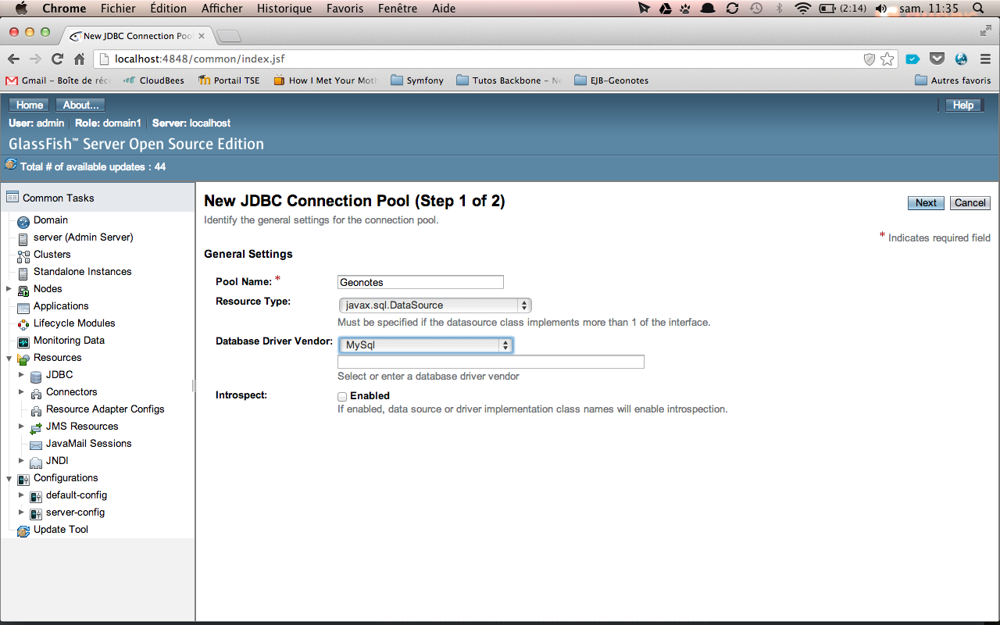
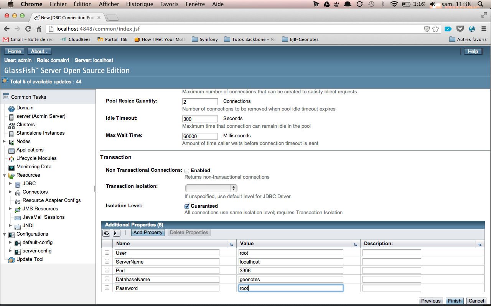
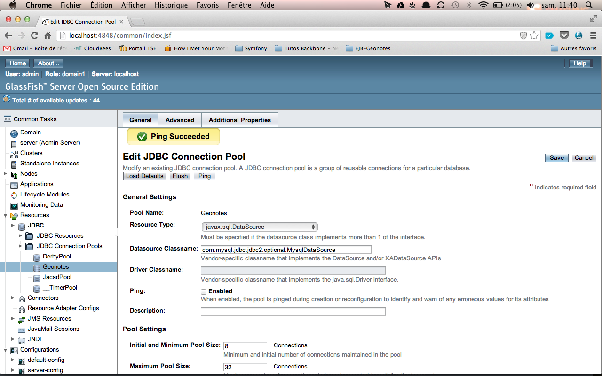
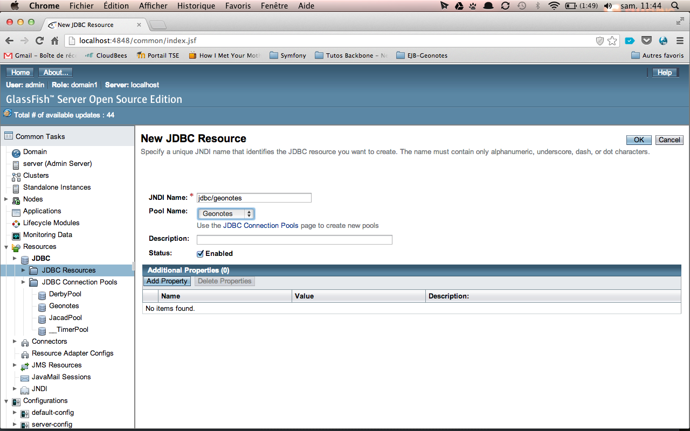

# Réseaux Middlewares

Ce rapport présente comment nous avons mis en place notre architecture côté serveur pour le projet et l'application Géonotes.

## Version de Java
Pour ce projet, nous avons choisi d'utiliser la dernière version de Java sortie (Java 7). Si vous lancez le projet sous Java 6, il est possible que des erreurs apparaissent en raison de l'utilisation de la notation <> lorsque la création de liste est implicite : `Set<Note> notes = new HashSet<>();` par exemple. 

## Configuration de Glassfish
Tout d'abord, il nous a fallu installer Glassfish sur notre machine et configurer le serveur afin que celui-ci stocke nos données. 

Concernant l'installation, il faut dézipper le fichier fourni par Glassfish, le placer dans le dossier de notre choix et, dans Eclipse, ajouter ce serveur. 

Ensuite, pour ce qui est de la connexion avec la base de données, il faut d'abord lancer le serveur. Ensuite, on se rend sur l'adresse de configuration ([http://locahost:4848](http://locahost:4848)) et on va dans l'onglet JDBC/JDBC Connection Pool. On crée un nouveau pool de connexion qui va nous permettre de faire communiquer le serveur avec notre base de données, ici une base MySQL. (Comme nous tournons sous MySQL, il faut penser à ajouter le driver de connexion dans les fichiers de Glassfish (`path/to/Glassfish/glassfish/modules`) )

On passe à l'étape suivante et on se rend en bas de la page afin d'indiquer toutes les ressources nécessaires pour se connecter à notre base de données (Nom d'utilisateur, mot de passe, nom du serveur, nom de la base de données et numéro du port)

Une fois cette configuration faite, on peut cliquer sur "Finish" et tester la connexion en cliquant sur "Ping" lorsque l'on affiche le pool de connexion: 

Une fois ce pool de connexion créé, il faut créer une ressource JDBC. Pour cela, on se rend dans l'onglet JDBC/resources et on ajoute une nouvelle ressource. Par convention, on la nomme `jdbc/geonotes` et on indique que le pool de connexion est celui que l'on vient de créer (Geonotes).

Ainsi, notre serveur Glassfish est configuré pour se connecter à notre base de données. 

## Architecture des fichiers 

Pour ce projet, nous avons choisi d'utiliser Maven qui est un gestionnaire de dépendances et qui va nous permettre également de déployer correctement nos ressources sous Glassfish. En effet, ce serveur nécessite qu'on déploie un fichier EAR qui va contenir des fichiers EJB et des fichiers WAR. Ainsi, notre projet va être constitué de deux parties majeures : l'archive EJB qui va contenir toutes nos classes d'accès aux données et de traitements liés et l'archive WAR qui contient nos fichiers pour la partie Web service. 

Les dépendances Maven et l'architecture du projet se configurent depuis le fichier pom.xml qui se trouve à la racine du projet pour chaque partie. Nous aurons donc trois fichiers pom.xml à écrire : un pour l'EAR, un pour l'EJB et un pour le WAR. Vous trouverez ces fichiers dans le projet rendu avec ce rapport. 

Pour les EJB, nous avons choisis de faire 2 classes, une pour récupérer les parcours et une autre pour gérer l'accès à la table des notes. Nous avons également créé deux classes pour représenter les données (parcours et notes). 